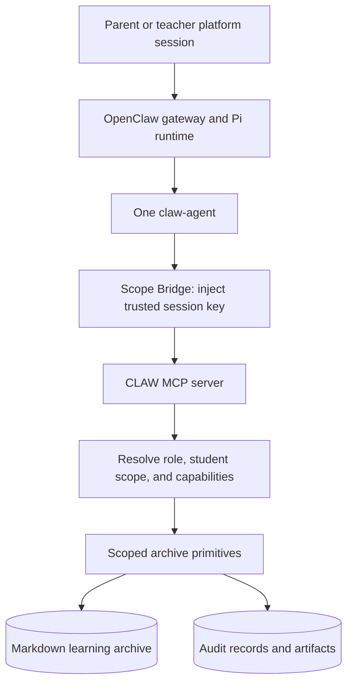

# school-claw

**Turn everyday learning observations into a useful student learning archive.**

CLAW is an education-agent prototype for the parents and teachers of one class. A parent can record an observation, ask about their own child's learning history, and request targeted practice. A teacher can work across the class and generate summaries, feedback, or error tables from the same archive.

The central product choice is to make the **long-term learning record** the asset. Chat is the input and retrieval interface; useful facts should survive the conversation, remain attributable to their source, and be available only to the right audience.

**Status:** implemented TypeScript scope, archive, audit, artifact, MCP, and OpenClaw integration layers, with local fixtures and runtime harnesses. Native Feishu/Lark onboarding has a defined evidence protocol but remains pending real-platform human verification. This repository does not establish classroom adoption or educational impact.

[Domain context](CONTEXT.md) · [Product brief](docs/product/CLAW_v1_product_prd.md) · [Architecture](docs/architecture/CLAW_v1_technical_architecture.md) · [OpenClaw baseline](docs/development/openclaw-baseline.md)

## The intended experience

| User need | System behavior | Boundary |
| --- | --- | --- |
| “My child misunderstood the question today.” | Append a durable observation with source metadata and an audit entry. | Write only to the authorized child's archive. |
| “What should we practice next?” | Read the learning record and create a practice artifact with source references. | Use evidence accessible to that child's audience. |
| “Summarize the class's recurring mistakes.” | Let a teacher read class records and generate a reusable error table. | Class-wide access belongs to the teacher role. |
| “Show me another child's record.” | Refuse access at the data layer. | A prompt or a model-supplied session ID must not grant authority. |

Version 1 deliberately excludes student-facing chat, OCR, homework-platform integration, and multi-school administration. This keeps the first validation focused on one loop: **observation → durable record → evidence-based follow-up → useful artifact**.

## Architecture



[OpenClaw](https://github.com/openclaw/openclaw) supplies message routing, sessions, the agent loop, model calls, and tool dispatch. This repository adds the education-domain contract, scoped MCP tools, Markdown archive operations, audit behavior, and the Scope Bridge integration.

There is one agent with separate parent and teacher sessions. The bridge overwrites tool-call `ssid` with the runtime's session key and blocks missing-session calls. The MCP server then resolves permissions and validates file paths. A `sessionKey` selects scope; it is **not authentication**. Native platform identity and authorized scope binding remain essential deployment prerequisites.

## Decisions you can inspect

| Decision | Code and regression evidence |
| --- | --- |
| Put authorization below the model | [`scope-get.ts`](src/scope/scope-get.ts), [`scope-bridge.ts`](src/openclaw/scope-bridge.ts), [`scope-bridge.test.ts`](tests/scope-bridge.test.ts) |
| Check canonical paths as well as logical file IDs | [`scoped-read.ts`](src/archive/scoped-read.ts), [`scoped-read.test.ts`](tests/scoped-read.test.ts) cover traversal and symlink escape cases. |
| Preserve provenance and audit writes | [`write-audit.ts`](src/archive/write-audit.ts), [`write-audit.test.ts`](tests/write-audit.test.ts), [`artifact.test.ts`](tests/artifact.test.ts) cover role restrictions and audit-failure behavior. |
| Expose reusable primitives through MCP | [`server.ts`](src/mcp/server.ts), [`mcp-artifact-create.test.ts`](tests/mcp-artifact-create.test.ts) exercise real local stdio tool calls. |
| Keep the agent inside the intended tool boundary | [`claw-agent-config.ts`](src/openclaw/claw-agent-config.ts), [`openclaw-agent-workspace-config.test.ts`](tests/openclaw-agent-workspace-config.test.ts) check configuration and native-tool restrictions. |
| Validate complete user journeys | [`claw-agent-capability-harness.test.ts`](tests/claw-agent-capability-harness.test.ts) covers observation, read-back, artifact, refusal, and teacher journeys when the pinned runtime is available. |

The Markdown archive makes records inspectable during an early pilot. It also imposes a clear tradeoff: this is a single-class prototype, not a distributed education-data platform.

## Try the local checks

Use Node.js 22 and pnpm. Installation fetches dependencies; the scope/read demos and tests use repository fixtures and do not need model or messaging-platform credentials.

```bash
git clone https://github.com/Leonxu6/school-claw.git
cd school-claw
pnpm install --frozen-lockfile --ignore-scripts

pnpm typecheck
pnpm test
pnpm demo:scope
pnpm demo:scoped-read
```

The read demo should produce:

```text
parent A reads student A -> OK (张三学习档案)
parent A reads student B -> FORBIDDEN
teacher reads class -> OK (五年级一班)
fileId "../..." -> FORBIDDEN
```

Fixture names and platform IDs are examples. OpenClaw-dependent tests are skipped when its external checkout is unavailable; read the test summary before interpreting a passing run as full integration coverage. GitHub Actions runs the repository checks; local runtime prerequisites still determine integration coverage. For a focused local gate:

```bash
pnpm test:scope
pnpm test:scoped-read
pnpm test:write-audit
pnpm test:artifact
pnpm test:scope-bridge
```

## Verify the OpenClaw boundary

Integration assumptions are pinned to upstream commit `da23f4572da7d59ef97688ad8b61771e5b708733`. Follow the [baseline document](docs/development/openclaw-baseline.md) to prepare that separate checkout and its dependencies, then point `OPENCLAW_DIR` at it.

```bash
export OPENCLAW_DIR=/absolute/path/to/openclaw
pnpm demo:sedimentation
pnpm demo:capability-harness
```

The capability harness exercises the real OpenClaw Pi runtime boundary with deterministic model fixtures and temporary archive data. It checks that the workspace contract is injected, a parent observation is written and read back, artifacts are created through MCP, and cross-student access is refused. This is runtime integration evidence; it does not prove the quality of a live model or a successful native-platform deployment.

## What remains before a classroom pilot

- **Native identity binding:** complete the [Feishu/Lark verification procedure](docs/development/0012-native-platform-binding-spike.md) using actual platform messages and role-bound peers.
- **Evidence-based acceptance:** the [binding-evidence template](docs/development/0012-native-platform-binding-evidence.template.json) intentionally fails validation until real evidence is supplied. Validate a completed local file with `pnpm validate:native-platform-binding /path/to/evidence.local.json`.
- **Real-user learning value:** fixture journeys do not demonstrate that recommendations improve learning or save teachers time. That needs a consented pilot and observation.
- **Operational hardening:** the scope registry includes fixture bindings; archive storage and locks target a small local deployment. Broader use needs real identity provisioning, data governance, and a reviewed storage/concurrency design.

## Stack and attribution

TypeScript · Node.js · MCP SDK · OpenClaw integration · Markdown storage · Vitest

This project builds **on OpenClaw**, rather than implementing its own general agent runtime. The upstream source and integration contracts are recorded in the [baseline](docs/development/openclaw-baseline.md); dependencies retain their own licenses. CLAW's domain model, access-control layer, archive primitives, audit/artifact behavior, and integration tests are the work presented here.

## 中文概述

school-claw 面向一个班级的家长与老师，把日常自然语言中的学习观察沉淀为长期学习档案，并基于档案回答问题、生成练习与反馈。核心取舍是先把「记录可积累、回答有依据、数据不越权」做好，再扩展功能。

项目基于 OpenClaw 运行时，主要实现教育领域的权限模型、Scope Bridge、MCP 工具、Markdown 档案、审计与产物生成。家长只能访问自己孩子的数据，老师可访问班级范围。仓库明确区分本地 fixture 测试、真实运行时集成测试与飞书/Lark 真平台验收；目前不能把前两者表述成已经完成真实班级上线。
